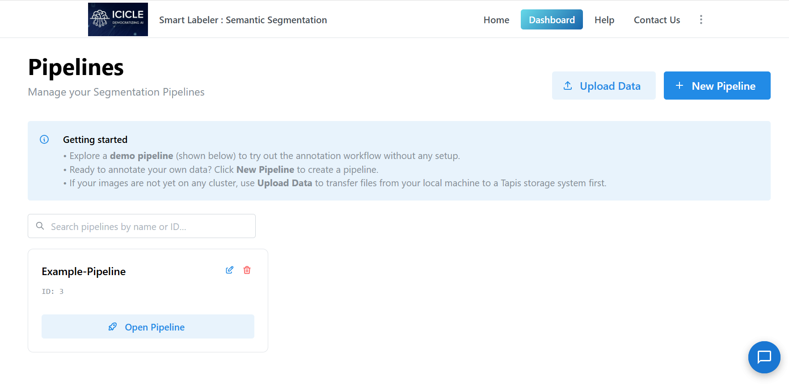
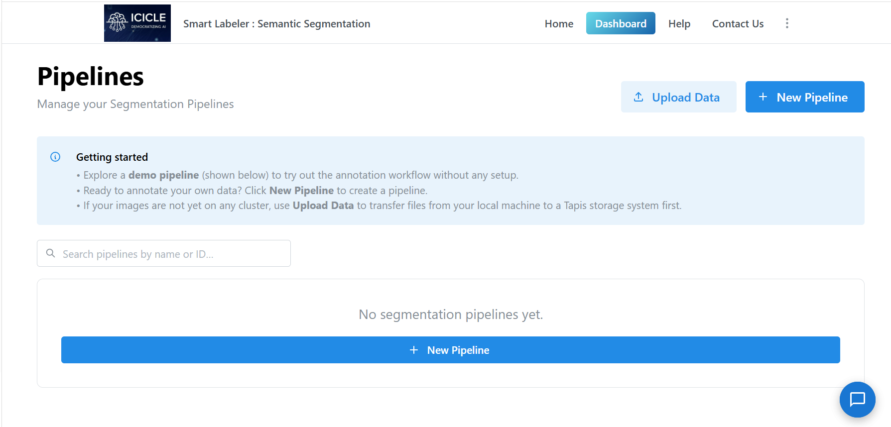
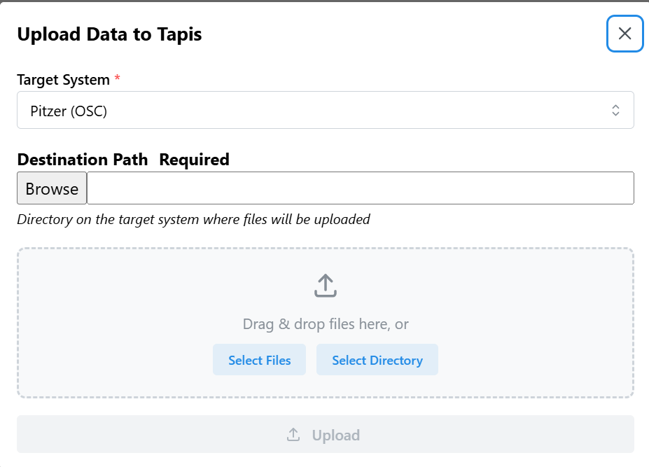
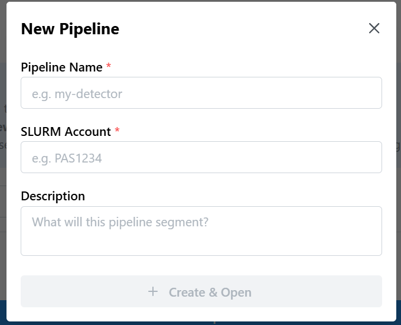
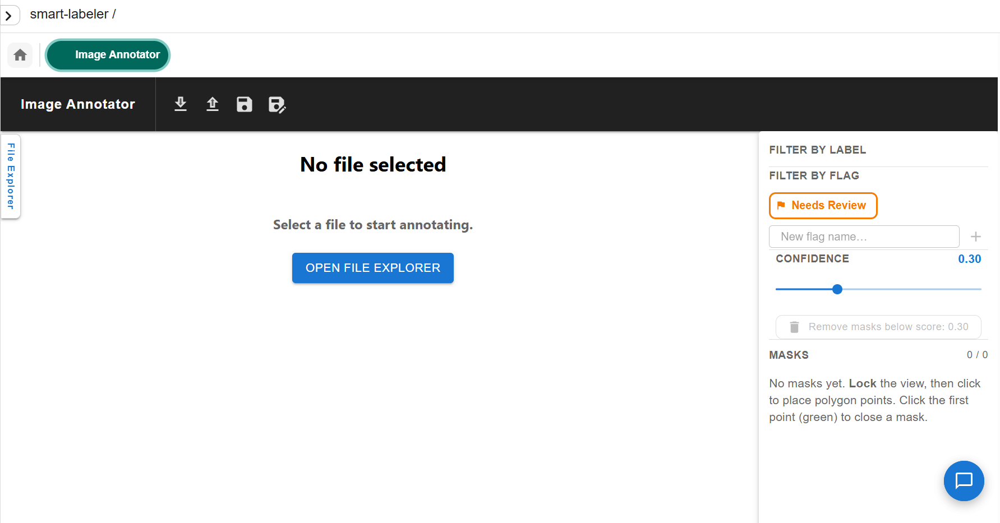
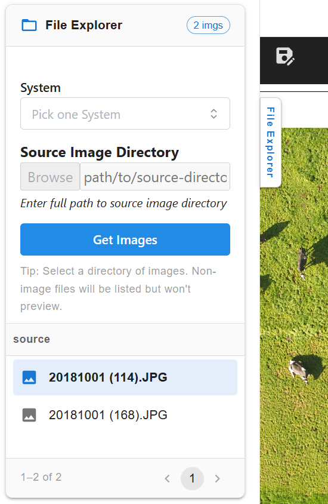

# Intelligent Semantic Segmentation & Annotation

A streamlined, HPC-backed pipeline dedicated exclusively to semantic and instance image segmentation using interactive masking tools and Tapis job execution.

### License

[](https://opensource.org/licenses/MIT)

**Tags:** AI4CI, CI4AI, Software

## References

- [Tapis v3 — HPC job execution framework](https://tapis-project.org)
- [Patra Model Registry — ICICLE AI model catalog](https://patra.pods.icicleai.tapis.io/)
- [SAM3 (Segment Anything Model 3) — Meta AI](https://github.com/facebookresearch/sam3)
- [SAHI — Slicing Aided Hyper Inference for small-object detection](https://github.com/obss/sahi)
- [COCO JSON format specification](https://cocodataset.org/#format-data)

## Acknowledgements

*National Science Foundation (NSF) funded AI institute for Intelligent Cyberinfrastructure with Computational Learning in the Environment (ICICLE) (OAC 2112606)*

## Issue reporting

Please open an issue at [github.com/OSU-SAI-Lab/smart-labeler/issues](https://github.com/OSU-SAI-Lab/smart-labeler/issues) with a description of the problem, steps to reproduce, and any relevant logs from the Tapis job status bar.

---

# Tutorials

### Running Your First Segmentation Pipeline

A complete walkthrough from raw images to labeled masks in 2 steps.

#### Prerequisites

- Access to a Tapis-connected HPC system (Pitzer, Expanse, Ascend, or Cardinal)
- A Tapis account with a valid Slurm account to charge
- A directory of images on a Tapis filesystem
- (Optional) A Hugging Face token for gated models such as SAM3

#### Getting Started

Navigate to the home page and click **Get Started** or **Dashboard**.


From the dashboard you can create a new segmentation pipeline or resume an existing one. Existing pipelines are listed with their unique ID and an **Open Pipeline** button. If no pipelines exist yet, a **New Pipeline** button appears in the center of the page.





To upload images from your local machine to a Tapis storage system before starting, click **Upload Data** in the top-right corner of the dashboard.



Click **+ New Pipeline** to open the creation modal. Provide a **Pipeline Name** and a **SLURM Account** (required). An optional **Description** field is also available. Click **Create & Open** to initialize the workspace.



#### Step 1 — Project Setup & Data Upload

##### Remote Data Staging

If your images are not already on the cluster, upload them before launching the segmentation canvas. Click **Upload Data** from the dashboard to open the upload modal. Select a **Target System** (e.g. Pitzer (OSC)) and provide an absolute **Destination Path** on that system. Drag and drop files into the drop zone or use **Select Files** / **Select Directory** to browse locally, then click **Upload**.


##### Blank Pipeline & File Explorer

After creating a new pipeline, the **Image Annotator** canvas opens in a blank state. Click **Open File Explorer** (or the **File Explorer** tab on the left edge) to open the slide-out panel.



In the File Explorer, select a **System** from the dropdown and enter the full path to your source image directory in the **Source Image Directory** field. Click **Get Images** to load image previews. Click any filename in the list to open that image in the annotation canvas.



#### Step 2 — Interactive Image Segmentation

##### The Segmentation Workspace

The annotation canvas shifts away from traditional bounding-box layouts into a dedicated polygon and pixel-masking workflow. The interface provides several controls:

- **Toolbar Core Utilities** — icons at the top of the canvas for download, upload (import), save, and refresh.
- **Confidence Thresholding** — a slider on the right panel adjusts mask visibility and retention levels dynamically based on model-assisted proposals.
- **Review Flagging** — masks requiring secondary verification can be tagged with a **Needs Review** status. Custom flag names can also be added.
- **Dynamic Mask Listing** — the right panel keeps an active tally of polygon masks applied to the current image, grouped by label, with per-mask point counts, bounding boxes, and confidence scores.
- **Filter by Label / Flag** — click any label or flag chip in the right panel to filter the displayed masks.

The canvas toolbar (left to right): zoom in, zoom out, reset view, **Smart Click** (SAM3-assisted masking), bounding box draw mode, polygon draw mode, image mode, outline width selector, and clear all.


##### Drawing Masks Manually

1. Switch to draw mode by selecting the pencil icon.
2. Click on the canvas to place polygon points around an object.
3. Click the first point (shown in green) to close the polygon and create the mask.
4. Assign or confirm a label for the mask in the right panel.

##### SAM3 Segmentation-Assisted Annotation

Click the **Smart Click** tool (magic wand icon) in the toolbar to open the SAM3 configuration panel. Two modes are available:

**Single Click mode** — enter a label, then click on any object in the image. SAM3 auto-generates a segmentation mask for that object.

**Text Prompt mode** — enter one or more comma-separated class labels (e.g. `cow, giraffe`). SAM3 runs open-vocabulary detection across the full image and returns masks for all matching objects.

Both modes expose the following settings:

- **Enable SAHI** — toggles Slicing Aided Hyper Inference, which divides the image into overlapping tiles before running inference. Significantly improves detection of small or densely packed objects in large images.
- **Crop Size (patch_size)** — tile size in pixels when SAHI is enabled (e.g. `640`). Smaller values catch finer details; larger values are faster.
- **Detection Confidence** — minimum confidence score (0–1) a detection must reach to be kept. Raise to reduce false positives; lower to catch more candidates.
- **Mask Precision** — controls how closely the mask contour follows object boundaries (0–1). Higher values produce finer, more detailed outlines; lower values give smoother, simplified shapes.

Click **Enter** to run inference, or **Exit** to close without running.

##### Finishing Up

When annotation is complete, click the **Save** icon in the toolbar. A **Save Annotations** modal opens where you select a cluster (e.g. `pitzer-tapis`), enter a remote **File Path** for the output JSON, and toggle between **COCO JSON** and **Default JSON** formats. A live format preview is shown before saving. Click **Save** to write the file to the Tapis filesystem.

To export to your local machine instead, click the **Download** icon and select **COCO JSON** or **Default JSON**.

To load an existing annotation file, click the **Import** (upload) icon. Choose a cluster and either browse for a local file or enter a remote path. Toggle the format switch to match the file format (**COCO JSON** or **Default JSON**) and click **Upload**.

---

# How-To Guides

### How to Create a Segmentation Pipeline

1. From the **Dashboard**, click **+ New Pipeline**.
2. Enter a **Pipeline Name** and a valid **SLURM Account**.
3. Optionally add a **Description**.
4. Click **Create & Open** — the Image Annotator canvas opens immediately.

### How to Upload Images to the Cluster

1. From the **Dashboard**, click **Upload Data**.
2. Select a **Target System** from the dropdown (e.g. Pitzer (OSC)).
3. Enter or browse to an absolute **Destination Path** on that system.
4. Drag and drop files into the upload zone, or click **Select Files** / **Select Directory**.
5. Click **Upload** to transfer.

### How to Use Smart Click (SAM3-Assisted Masking)

1. Open an image in the annotation canvas.
2. Click the **Smart Click** tool (magic wand / wand-with-sparkle icon) in the toolbar.
3. Select **Single Click** mode and enter a label, then click on an object to generate its mask automatically.
4. Optionally enable **SAHI** and adjust **Crop Size** for better coverage of small objects in large images.
5. Click **Enter** to apply.

### How to Use Text Prompt Annotation

1. Open an image in the annotation canvas.
2. Click the **Smart Click** tool and switch mode to **Text Prompt**.
3. Enter a comma-separated list of class names (e.g. `zebra, giraffe`).
4. Optionally enable **SAHI** for improved small-object recall.
5. Click **Enter** — SAM3 generates masks for all detected instances of those classes.

### How to Flag Masks for Review

1. In the right panel, locate the mask in the **Masks** list.
2. Click the flag icon next to a mask entry to mark it as **Needs Review**.
3. Use the **Filter by Flag** section at the top of the right panel to show only flagged masks.
4. Add custom flag names using the **New flag name...** field and the **+** button.

### How to Filter Masks by Label or Flag

- Click any label chip in the **Filter by Label** section to show only masks of that class.
- Click any flag chip in the **Filter by Flag** section to show only masks with that flag.
- Clicking an active chip again deselects it and shows all masks.

### How to Remove Low-Confidence Masks

1. Adjust the **Confidence** slider in the right panel to the desired threshold.
2. Click **Remove masks below score: X.XX** to permanently delete all masks under that threshold.

### How to Save Annotations to the Cluster

1. Click the **Save** (floppy disk) icon in the toolbar.
2. Select a cluster system from the dropdown.
3. Enter the full remote **File Path** (e.g. `/path/to/save/annotations.json`).
4. Toggle **COCO JSON** on or off to select the output format.
5. Click **Save**.

### How to Import Existing Annotations

1. Click the **Import** (upload arrow) icon in the toolbar.
2. Select the cluster from the dropdown or click **Browse File** to upload from your local machine.
3. Enter the remote path in **Or Enter File Path** if the file is already on the cluster.
4. Toggle the format switch to match your file (**COCO JSON** or **Default JSON**).
5. Click **Upload**.

### How to Download Annotations Locally

Click the **Download** icon in the toolbar and select **COCO JSON** or **Default JSON**. The file is saved directly to your local machine.

### How to Resume a Segmentation Pipeline

From the **Dashboard**, find the pipeline by name or ID using the search bar. Click **Open Pipeline** on the pipeline card to return to the Image Annotator at the current state.

### How to Set Up Hugging Face Access

Some models used by Smart Labeler (SAM3) are gated on Hugging Face and require an account, approved access, and a personal token. Complete all four steps in order.

#### Step 1 — Create a Hugging Face Account

Go to [huggingface.co](https://huggingface.co) and click **Sign Up**. Enter your email, choose a username and password, and verify your email address. Complete your profile (name, organization if applicable).

> **Tip:** Use a professional or institutional email address — it improves your chances of approval for gated models. If you already have an account, skip to Step 2.

#### Step 2 — Request Access to SAM3

SAM3 is a gated model hosted by Meta. You must agree to their usage terms before you can use it.

1. Open the SAM3 model page: [huggingface.co/facebook/sam3](https://huggingface.co/facebook/sam3)
2. Click **Request Access** and fill in your details (first name, last name, date of birth, country, affiliation, job title).
3. Accept the Meta Privacy Policy terms and click **Submit**.
4. You will see a confirmation that your request is pending review.
5. Once approved, the model page shows: *"Gated model — You have been granted access to this model."*

> **Tip:** You will receive an email when approved. Check your spam folder if you don't see it after 24 hours.

#### Step 3 — Generate a Hugging Face Access Token

Once your access request is approved, generate an API token so Smart Labeler can authenticate model downloads on your behalf.

1. Navigate to your token settings: [huggingface.co/settings/tokens](https://huggingface.co/settings/tokens)
2. Click **+ Create new token**.
3. Set the **Token Type** to **Read** and give it a descriptive name (e.g., `ICICLE-TapisAccess`).
4. Click **Create token** and copy the value immediately — it is only shown once.

> **Warning:** Treat your token like a password. Do not share it or commit it to a repository. If you lose it, revoke it and generate a new one from the same settings page.

#### Step 4 — Add the Token in ICICLE / Tapis

With your token ready, add it to your ICICLE/Tapis credentials so it can be injected securely into HPC jobs.

1. Log in to your ICICLE/Tapis account.
2. Navigate to the **Settings** section indicated by 3 dots on the dashboard.
3. Click on **Access Key**.
4. Paste your token and save.
5. Click on **Revoke token** to permanently delete the token if needed.

---

# Explanation

### Segmentation Pipeline Architecture

The Semantic Segmentation pipeline is a focused 2-step workflow optimized for mask-based annotation. Pipeline state is persisted in a PostgreSQL database and output files are stored on Tapis-connected HPC filesystems.

```
Step 1: Project Setup & Data Upload  → images staged to Tapis filesystem
Step 2: Interactive Image Segmentation → polygon/pixel masks (COCO JSON or Default JSON)
```

### Annotation Approach

The segmentation workflow uses **polygon masking** rather than bounding boxes, producing pixel-level boundaries for each object instance. Masks can be:

- **Drawn manually** by placing polygon points on the canvas.
- **Auto-generated** using SAM3 in Single Click or Text Prompt mode, with optional SAHI tiling for large images or small objects.

Each mask records point coordinates, bounding box, confidence score, and label. The right panel dynamically lists all masks with per-mask metadata and inline controls for editing, flagging, and deletion.

### Output Formats

Two export formats are supported throughout the pipeline:

- **COCO JSON** — standard format compatible with annotation tools (CVAT, Roboflow) and training frameworks (MMDetection, Detectron2).
- **Default JSON** — tool-native format for round-tripping annotations back into Smart Labeler.

### SAM3 and SAHI

SAM3 (Segment Anything Model 3) runs as an external microservice called synchronously from the annotation canvas. SAHI (Slicing Aided Hyper Inference) partitions large images into overlapping tiles before inference, then merges results — significantly improving recall for small or densely packed objects.

### Tapis Integration

The segmentation pipeline leverages the Tapis Files API for all remote file I/O, keeping image data and annotation outputs on the user's allocated HPC storage. The Upload Data modal on the dashboard provides a direct path to stage local data to any Tapis-connected system before annotation begins.
